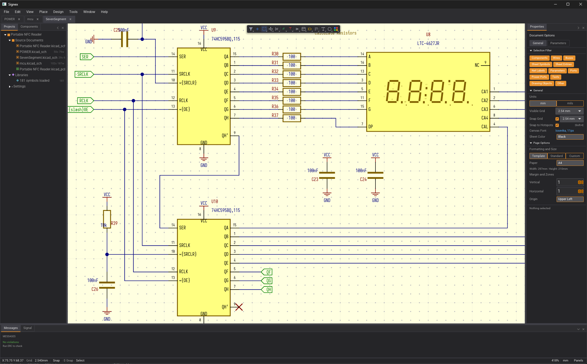
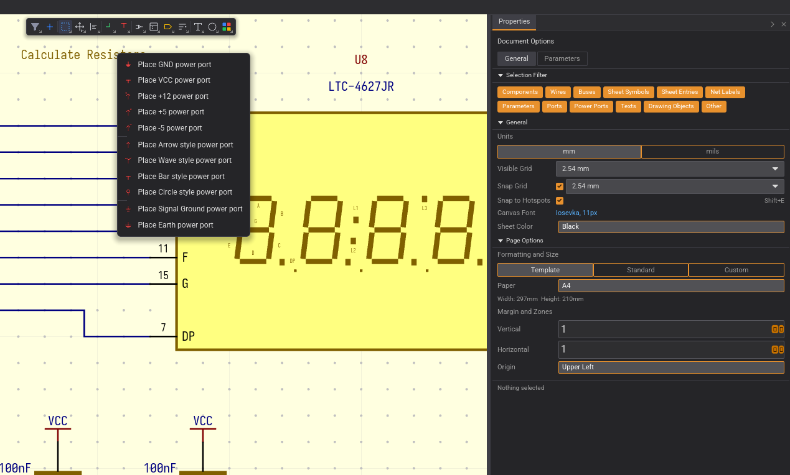
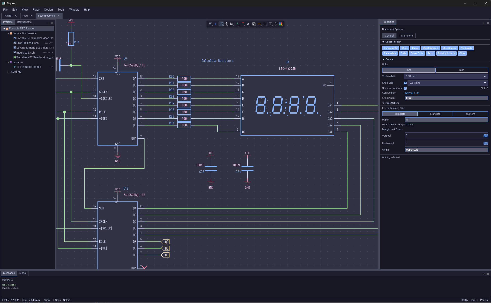
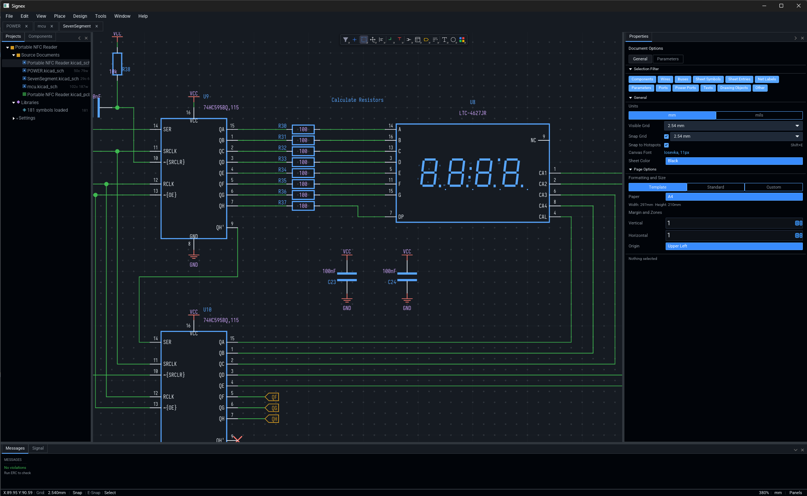
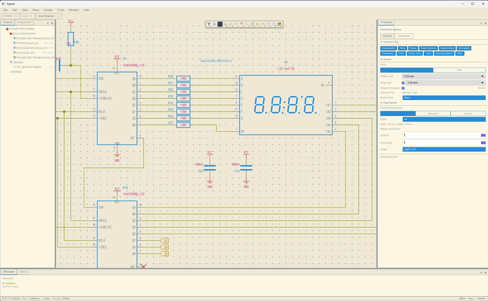

<p align="center">
  
</p>

<h1 align="center">Signex</h1>
<p align="center">
  Open-source, AI-first electronics design automation
</p>

<p align="center">
  <a href="https://github.com/alplabai/signex/blob/dev/LICENSE"></a>
  <a href="https://github.com/alplabai/signex/releases/tag/v0.14.0"></a>
  <a href="https://www.rust-lang.org/"></a>
  <a href="https://github.com/alplabai/signex/wiki"></a>
  <a href="https://github.com/alplabai/signex/discussions"></a>
</p>

<p align="center">
  <a href="#features">Features</a> &middot;
  <a href="#screenshots">Screenshots</a> &middot;
  <a href="#building">Building</a> &middot;
  <a href="#roadmap">Roadmap</a> &middot;
  <a href="https://github.com/alplabai/signex/wiki">Wiki</a> &middot;
  <a href="#contributing">Contributing</a> &middot;
  <a href="#license">License</a>
</p>

---

Signex is open-source EDA tooling built in Rust with GPU-accelerated
rendering and an Altium Designer-quality UI — schematic + PCB editor,
3D viewer, simulation, plugin system. Native file formats (`.snxsch`,
`.snxpcb`) are line-diffable in git and ~5× smaller than the equivalent
JSON.

**Migrating from KiCad?** The optional [signex-kicad-import](https://github.com/alplabai/signex-kicad-import)
companion tool (GPL-3.0-or-later, distributed independently) converts
`.kicad_sch` / `.kicad_pcb` / `.kicad_pro` files to Signex's native
formats one-way. Run it once against your project; open the resulting
`.snxprj` in Signex.

**Two editions from one codebase:**

- **Signex Community** (Apache-2.0, free forever) — full schematic + PCB
  editor, 3D viewer, simulation, plugin system
- **Signex Pro** (subscription) — adds Signal AI (Claude-powered design
  copilot), real-time collaboration, and Signex 365 cloud PLM

> **Status:** Early development — **v0.14.0 shipped** — the **Footprint
> Editor** milestone. The `.snxfpt` pad + parametric-sketch editor is
> now enabled: place pads, draw a parametric sketch driven by an
> Apache-clean Newton-LM constraint solver (19 constraint kinds), and
> bake to pads / silk / courtyard. v0.14 completes the active-bar tooling
> (Align / Distribute, Move / Drag, Fill / Region, Text Frame, the
> selection-filter All toggle) and exposes the full constraint set. The
> v0.13 **clean-room schematic renderer** and the **Symbol & Library**
> surfaces (unified Active Bar, `.snxsym` TOML envelope, Library Browser,
> Pick Symbol / Footprint) carry forward.
> [Join the discussion](https://github.com/alplabai/signex/discussions) or check the [roadmap](#roadmap).

## Features

**What works today (v0.1–v0.14):**

- Open native Signex schematics (`.snxsch`, `.snxsym`, `.snxprj`); migrate
  legacy KiCad files via the [signex-kicad-import](https://github.com/alplabai/signex-kicad-import)
  companion tool
- Full schematic editing: select, move, wire (W), bus (B), label (L),
  component placement (P), delete, rotate (Space), mirror (X/Y)
- Advanced shape tools — Line, Rectangle, Circle, Arc (3-click), Polygon
  (click-by-click), editable drawing Properties with live preview
- Copy/paste, undo/redo (100 levels), save to the native `.snxsch` /
  `.snxprj` format (TOML envelope + TSV bulk blocks, line-diffable in git)
- 6 built-in themes with customizable theme editor
- Altium-style docking panels with drag-to-undock/dock
- Active Bar — 14-button floating toolbar with dropdown menus
- Context menu, in-place text editing (F2), selection filter
- Properties panel with context-aware field editing, Parameter Manager
- **Multi-window editing (v0.7)** — undock any tab into its own OS window
  and edit it independently; each window keeps its own pan/zoom, selection,
  and undo/redo history
- **ERC validation (v0.7)** — 11 Altium-style rules including cross-sheet
  hierarchy checks and net-label conflicts; Messages panel with click-to-zoom
- **Annotation (v0.7)** — four modes, review-and-confirm dialog,
  lock/unlock per designator, project-wide consistency
- F5 net-color palette, F8 ERC, F9 AutoFocus (dim unrelated objects)
- Pin connection matrix (12×12, per-cell severity override)
- Lasso + Inside/Outside/TouchingLine selection modes (Shift+S to cycle)
- Native `.snxsch` / `.snxpcb` formats — TOML envelope + TSV bulk blocks,
  line-diffable, ~5× smaller than JSON, single file per design
- 60fps pan/zoom on schematics with 500+ components
- **Output (v0.8)** — PDF export with bookmarks + theme palette, Altium-spec
  BOM preview with column/variant pickers and CSV/HTML/XLSX export, KiCad
  netlist export, unified Print Preview / Export PDF modal
- **Multi-project workspaces (v0.8)** — multiple projects open side-by-side,
  per-tab project scoping, accent-tinted active project root
- **Altium-style dirty tracking (v0.8)** — closing tabs never prompts;
  project-close lists every dirty file with Save All / Discard All / Cancel
- **Hierarchical sheet polish (v0.8)** — Altium-port-style child-sheet pins,
  per-sheet stroke/fill colours, multisheet style preference
- **TabPill chrome refactor (v0.8)** — 3-sided shared borders, theme-aware
  inactive fill, drag accent from theme
- **Apache-clean native formats (v0.9)** — `.snxsch` / `.snxpcb` are the
  canonical format; KiCad I/O moved to the optional companion tool
- **Component library subsystem (v0.10–v0.11)** — Library Browser tab, DBLib
  row model, SCH Library editor, Component Preview, Pick Symbol/Footprint +
  auto-mount, DigiKey / Mouser / LCSC / JLCPCB distributor adapters,
  per-library git version control + History panel
- **Clean-room schematic renderer + Symbol editor (v0.13)** — renderer
  reimplemented against Signex-only specs (`docs/RENDERING_RULES.md`,
  IEEE-Std-91); unified Active Bar and TOML `.snxsym` envelope
- **Multi-unit symbols (v0.14)** — `part_count`, per-unit body geometry and
  graphics, unit buttons, two-click rect / line / circle + three-click arc
- **Footprint & sketch editor (v0.14)** — `.snxfpt` pad + parametric-sketch
  editor driven by an Apache-clean Newton-LM constraint solver (19 constraint
  kinds); bake to pads / silk / courtyard; Align / Distribute / Move / Fill /
  Text tooling; CPU 3D-body extrude preview
- **Authoritative netlist contract (v0.14)** — one connectivity derivation in
  `signex-net` (`build_netlist` / `build_project_netlist`) consumed by ERC,
  net-flood, and export; same-name labels + T-junctions merge correctly
- **Configurable keyboard-shortcut profiles (v0.14)** — grouped, searchable
  in-app editor; menu labels sourced from the command table
- **GPU schematic render path (v0.14)** — `signex-gfx` aligned to iced's
  wgpu 27; schematic render module via the shader widget (feature-gated)

**What's next:**

| Version | Milestone |
|---|---|
| **v1.0** | **Community Preview** — schematic-only release |
| **v2.0–v2.2** | **Community Release** — full PCB editor (viewer, routing, DRC, output) |
| **v2.3–v2.5** | 3D Viewer, Advanced PCB, High-Speed Design |
| **v3.0** | **Pro Release** — Signal AI + plugins + collaboration |
| **v4.0** | Unified simulation view with SPICE, EM, thermal |
| **v5.0** | Signex 365 cloud PLM |

## Screenshots

<p align="center">
  
  <br>
  <em>Active Bar with dropdown menus, Selection Filter tags, Properties panel with document options</em>
</p>

<details>
<summary><strong>More themes</strong></summary>

<p align="center">
  
  
  <br>
  
  <br>
  <em>Catppuccin Mocha, GitHub Dark, Solarized Light — 6 themes built in, fully customizable</em>
</p>

</details>

## Architecture

A 17-crate Rust workspace (`edition = 2024`), an acyclic DAG with
`signex-app` at the apex and `signex-types` as the shared foundation:

```
signex/
├── crates/
│   ├── signex-app/            # Main binary — iced 0.14 app (panels, dock, canvas, editors)
│   ├── signex-types/          # Domain types — schematic/PCB/layer/theme — NO rendering deps
│   ├── signex-engine/         # Command / patch / undo engine for schematic edits
│   ├── signex-net/            # Authoritative netlist + connectivity contract
│   ├── signex-erc/            # ERC rule engine (+ signex-erc-dsl)
│   ├── signex-sketch/         # Apache-clean Newton-LM constraint solver + sketch schema
│   ├── signex-bake/           # Sketch → footprint bake (pad / silk / courtyard / mask / …)
│   ├── signex-output/         # PDF / netlist / BOM export pipeline (+ signex-bom)
│   ├── signex-renderer/       # Domain types → render primitives (+ signex-gfx wgpu pipelines)
│   ├── signex-library/        # .snxlib component library — port/adapter model (+ signex-library-server)
│   ├── signex-widgets/        # Reusable iced widgets (tree view, active bar, previews)
│   └── signex-3d-model-importer/  # STEP / WRL importer for 3D body attach
└── Cargo.toml
```

**Design principles:**

- **Native `.snx*` formats first.** `.snxsch` / `.snxpcb` / `.snxprj` are the canonical format (TOML envelope + TSV bulk blocks, line-diffable, ~5× smaller than JSON). One-way KiCad → Signex import is an optional, independently-distributed companion tool.
- **Elm architecture (MVU).** iced's `state → view → Message → update` cycle; `view` is pure, `update` is the only mutation site and never blocks — all IO returns as a `Task`. No process-global mutable state.
- **Domain logic in domain crates.** Types and engines below `signex-app` carry zero `iced`/`wgpu` deps (Cargo-enforced); connectivity is derived once in `signex-net` and read everywhere else, never re-derived.
- **Multi-window by default.** Built on `iced::daemon`; every undocked tab gets its own engine + canvas keyed by window id, so two schematics can be edited in parallel without cross-talk.
- **Nanometer coordinates.** `i64` nanometers internally; exact in both metric and imperial — no float `EPS` comparisons for "same point".
- **Canvas for schematic, Shader for PCB.** CPU tessellation for schematics, GPU instanced rendering (`signex-gfx`, wgpu 27) for large PCB scenes.

## Hardware Requirements

Signex uses [wgpu](https://wgpu.rs) for hardware-accelerated rendering and
expects a modern GPU with effective Vulkan 1.1 (Linux), DirectX 12 (Windows),
or Metal (macOS) support. In practice this means **a GPU released around 2014
or later** — Intel HD Graphics 4400+, NVIDIA GeForce 600-series and newer, AMD
Radeon HD 7000-series and newer, or any Apple Silicon Mac.

Older GPUs that only expose legacy OpenGL may still launch the app via the
fallback path, but expect rendering glitches such as overlapping panels and
broken layout — these GPUs are not supported.

## Building

**Prerequisites:** Rust 1.88+ (edition 2024 plus let-chains) and a GPU supporting
Vulkan, Metal, or DX12.

```bash
git clone https://github.com/alplabai/signex.git
cd signex
cargo run -p signex-app          # Run
cargo test --workspace           # Test
cargo clippy --workspace -- -D warnings  # Lint
```

## Roadmap

| Milestone | Version | Status |
|---|---|---|
| Scaffold — Iced shell, panels, themes, dock system | v0.1 | Done |
| Parser — KiCad format read/write, domain types | v0.2 | Done |
| Canvas — wgpu pan/zoom/grid, Altium-style camera | v0.3 | Done |
| Schematic Viewer — render all elements, multi-sheet nav | v0.4 | Done |
| Schematic Editor — select, move, wire, undo/redo, save | v0.5 | Done |
| Full SCH Editor — copy/paste, labels, components, Active Bar | v0.6 | Done |
| Validation + Multi-Window — ERC, annotation, pin matrix, undockable tabs | v0.7 | Done |
| Output — PDF, BOM, netlist, multi-project workspaces, dirty tracking | v0.8 | Done |
| Native file formats — `.snxsch` / `.snxpcb` TOML+TSV; KiCad I/O via signex-kicad-import companion | v0.9 | Done |
| Library Browser tab — read-only `.snxlib` table | v0.10 | Done |
| Library & Polish — full DBLib model, SCH Library editor, Component Preview, picker + auto-mount, distributor adapters | v0.11 | Done |
| Symbol & Library — clean-room schematic renderer, unified Active Bar in symbol editor, `.snxsym` TOML envelope | v0.13 | Done |
| Footprint Editor — `.snxfpt` pad + parametric-sketch editor, Newton-LM solver (19 constraints), Align/Distribute/Move/Fill/Text tooling | v0.14 | Done |
| **Community Preview** — schematic-only editor | **v1.0** | |
| PCB Viewer — GPU rendering, layers, cross-probe | v2.0 | |
| PCB Routing + DRC + Output | v2.1–v2.2 | |
| **Community Release** — full schematic + PCB editor | **v2.2** | |
| 3D Viewer, Advanced PCB, High-Speed Design | v2.3–v2.5 | |
| **Pro Release** — Signal AI + plugins + collaboration | **v3.0** | |
| Simulation — SPICE, EM, thermal, simulation wizards | v4.0–v4.1 | |
| **Signex 365** — cloud PLM, BOM Studio, ERP bridge | **v5.0** | |

See [docs/ROADMAP.md](docs/ROADMAP.md) for the detailed version plan.

## Documentation

The **[Signex Wiki](https://github.com/alplabai/signex/wiki)** is the user
guide — installation, quick start, keyboard shortcuts, and feature-by-feature
walkthroughs (ERC, annotation, multi-window editing, hierarchical sheets,
net-color pen, the library subsystem, the symbol + footprint editors, themes,
and more), plus an FAQ and roadmap.

Start with **[Quick Start](https://github.com/alplabai/signex/wiki/Quick-Start)**
to open your first Signex project, or jump straight to
**[Keyboard Shortcuts](https://github.com/alplabai/signex/wiki/Keyboard-Shortcuts)**
for the full reference. In-repo docs live under
[`docs/`](docs/) — see [ROADMAP.md](docs/ROADMAP.md),
[LICENSING.md](docs/LICENSING.md), and
[REPOSITORY_AND_CODEBASE.md](docs/REPOSITORY_AND_CODEBASE.md).

## Contributing

Signex is open source and we welcome contributions from everyone — whether
you're an EDA professional, a Rust developer, or someone who just wants to
help build a better design tool.

**Ways to contribute:**

- Report bugs or rendering discrepancies
- Add test fixtures from real projects
- Implement a feature from the [roadmap](docs/ROADMAP.md)
- Fix an [open issue](https://github.com/alplabai/signex/issues)
- Improve documentation

**Quick start:**

```bash
git clone https://github.com/alplabai/signex.git
cd signex
cargo build --workspace
cargo run -p signex-app
```

See **[CONTRIBUTING.md](CONTRIBUTING.md)** for the full guide: branching
workflow, crate map, code style, and good first issues.

## License

Signex Community Edition is licensed under the [Apache License 2.0](LICENSE).
The main repository contains no GPL-derived code; Apache consumers (anyone
embedding or linking against Signex) get a clean Apache codebase with no GPL
aggregation in their build closure.

KiCad migration is provided via the optional [signex-kicad-import](https://github.com/alplabai/signex-kicad-import)
companion tool, which is **GPL-3.0-or-later** because it implements KiCad's
file format with structure derived from KiCad's GPL-3.0 source. The two
projects are distributed independently. See [docs/LICENSING.md](docs/LICENSING.md)
for the full rationale and the audit trail behind the two-repo split.

Copyright 2026 [Alp Lab AI](https://github.com/alplabai)
